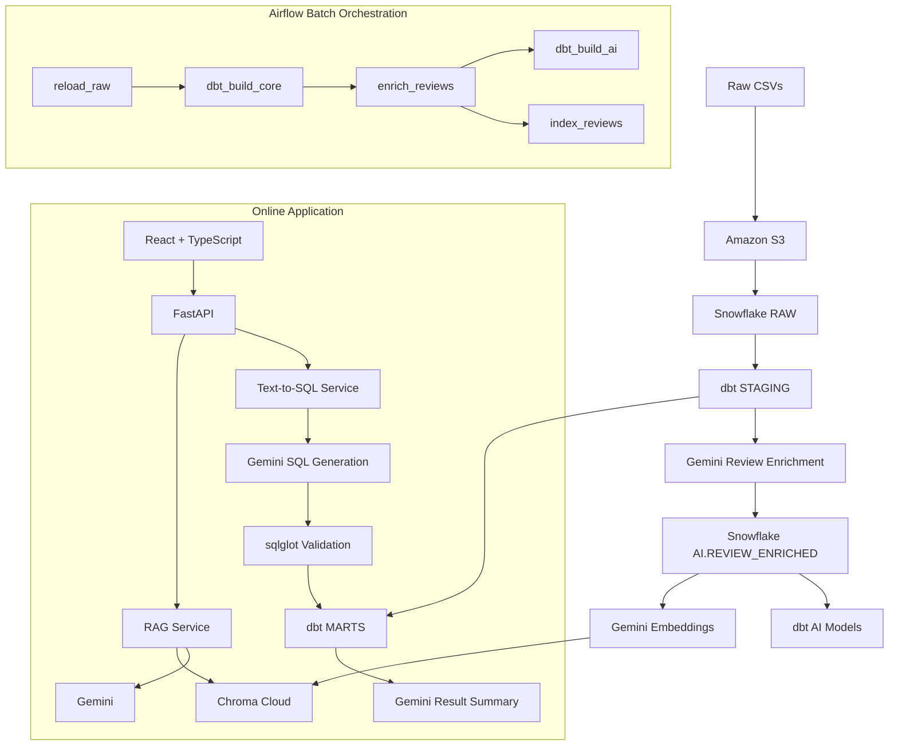

# Zomato AI Data Pipeline & Analytics

An end-to-end **data engineering + AI analytics** project for a Zomato-style food-delivery dataset.

The project combines a modern batch data stack with two interactive AI experiences:

- **Review Intelligence (RAG)** — ask questions about customer reviews and get grounded answers with source reviews.
- **Data Intelligence (Text-to-SQL)** — ask business questions in natural language, generate safe Snowflake SQL, execute it, and return the answer, query, table, and visualizations.

The pipeline is built around **Amazon S3 → Snowflake → dbt → Airflow**, with **Gemini, ChromaDB, FastAPI, React, TypeScript, shadcn/ui, and Recharts** powering the AI and application layers.

---

## Architecture



---

## What This Project Builds

| Layer | Technology | Purpose |
|---|---|---|
| Data lake | Amazon S3 | Stores raw source CSV files |
| Warehouse | Snowflake | RAW, STAGING, MARTS, SNAPSHOTS, AI schemas |
| Transformation | dbt | Cleans, tests, models, and builds analytics marts |
| Orchestration | Apache Airflow 3 + Docker | Runs the batch pipeline |
| Review enrichment | Gemini + LangChain | Sentiment, score, topic, and key issue extraction |
| Vector search | Gemini Embeddings + Chroma Cloud | Semantic retrieval over customer reviews |
| RAG | LangChain + Gemini | Review-grounded conversational analytics |
| Text-to-SQL | Gemini + sqlglot + Snowflake | Natural-language business analytics |
| Backend | FastAPI | Serves RAG and Text-to-SQL APIs |
| Frontend | React + TypeScript + shadcn/ui + Recharts | Interactive analytics interface |

---

## Core Features

### 1. Batch Data Pipeline

Raw source data is loaded from S3 into Snowflake and transformed through dbt.

```text
S3
 ↓
Snowflake RAW
 ↓
dbt STAGING
 ↓
dbt MARTS
```

The project follows a medallion-style warehouse design:

- **RAW** — source-aligned ingestion tables.
- **STAGING** — cleaned and conformed dbt models.
- **MARTS** — business-ready dimensions, facts, and analytical marts.
- **SNAPSHOTS** — historical/SCD tracking.
- **AI** — AI-generated enrichment and indexing state.

---

### 2. Airflow Orchestration

Airflow runs locally in Docker using the Airflow 3 architecture.

The main DAG is:

```text
reload_raw
    ↓
dbt_build_core
    ↓
enrich_reviews
   ↙              ↘
dbt_build_ai    index_reviews
```

Tasks:

- `reload_raw` — loads files from the Snowflake external stage.
- `dbt_build_core` — builds/tests all non-AI dbt models.
- `enrich_reviews` — incrementally enriches customer reviews with Gemini.
- `dbt_build_ai` — builds AI-dependent dbt models.
- `index_reviews` — incrementally embeds enriched reviews and upserts them to Chroma Cloud.

The AI jobs are idempotent: already-processed reviews are skipped unless their content or index version changes.

> For this portfolio project, Airflow can remain local. The deployed web application reads from Snowflake and Chroma Cloud, so manually running the DAG on your PC refreshes the data used by the live app.

---

## AI Layer

### Review Enrichment

Customer reviews are converted into structured fields:

```json
{
  "sentiment_label": "negative",
  "sentiment_score": -0.9,
  "topic": "food quality",
  "key_issue": "Food arrived cold"
}
```

The enrichment job writes results to:

```text
ZOMATO.AI.REVIEW_ENRICHED
```

Processing is configurable with environment variables such as:

```env
ENRICH_BATCH_SIZE=5
ENRICH_MAX_PER_RUN=20
```

---

### Review Intelligence — RAG

The RAG pipeline uses:

```text
Snowflake enriched reviews
        ↓
Gemini embeddings
        ↓
Chroma Cloud
        ↓
Semantic retrieval
        ↓
Gemini
        ↓
Answer + supporting reviews
```

Each Chroma document keeps useful metadata such as:

- review ID
- city
- rating
- sentiment
- topic
- key issue

The indexing job stores synchronization state in:

```text
ZOMATO.AI.RAG_INDEX_STATE
```

so unchanged reviews are not embedded again.

---

### Data Intelligence — Text-to-SQL

Users can ask questions such as:

> Which restaurants generated the most orders?

The backend performs:

```text
Natural-language question
        ↓
Snowflake MARTS schema context
        ↓
Gemini SQL generation
        ↓
sqlglot safety validation
        ↓
Snowflake read-only execution
        ↓
Actual query result
        ↓
Gemini result explanation
```

Safety is enforced at multiple levels:

1. Prompt-level SQL restrictions.
2. `sqlglot` AST validation.
3. Only one `SELECT` statement is allowed.
4. Only `ZOMATO.MARTS` can be queried.
5. Every physical table must be fully qualified.
6. Snowflake uses a dedicated read-only `TEXT_TO_SQL_ROLE`.
7. Query execution has row and statement-time limits.
8. Failed SQL gets at most one controlled repair attempt.

---

## API

FastAPI exposes the AI application layer.

### Health

```http
GET /health
```

### RAG

```http
POST /api/rag/chat
```

Example request:

```json
{
  "question": "What are customers complaining about?",
  "top_k": 5
}
```

The response contains:

- generated answer
- supporting reviews
- review metadata

### Text-to-SQL

```http
POST /api/sql/query
```

Example request:

```json
{
  "question": "Show me the top 5 restaurants by number of orders."
}
```

The response contains:

- natural-language answer
- generated SQL
- query explanation
- result columns
- result rows
- tables used
- repair status
- truncation status

Interactive API documentation is available at:

```text
http://localhost:8000/docs
```

when the backend is running locally.

---

## Repository Structure

```text
Zomato-Data-Pipeline/
│
├── airflow/
│   ├── dags/
│   │   └── zomato_batch.py
│   ├── Dockerfile
│   ├── docker-compose.yaml
│   └── .env.example
│
├── frontend/
│   ├── public/
│   ├── src/
│   ├── package.json
│   └── README.md
│
├── snowflake/
│   └── ... Snowflake setup / integration SQL
│
├── src/
│   └── ai/
│       ├── api/
│       │   ├── main.py
│       │   └── routes/
│       ├── chains/
│       ├── db/
│       ├── embeddings/
│       ├── jobs/
│       │   ├── enrich_reviews.py
│       │   └── index_reviews.py
│       ├── llm/
│       ├── prompts/
│       ├── schemas/
│       ├── services/
│       ├── sql/
│       └── vectorstores/
│
├── zomato_dbt/
│   ├── models/
│   │   ├── staging/
│   │   └── marts/
│   ├── snapshots/
│   ├── macros/
│   ├── dbt_project.yml
│   └── profiles.yml
│
├── .gitignore
├── requirements-web.txt
└── README.md
```

Large source datasets, local logs, virtual environments, dbt build artifacts, and secret `.env` files should not be committed.

---

## Snowflake Roles

Two roles keep responsibilities separated.

### `DBT_ROLE`

Used by:

- dbt
- Airflow
- enrichment jobs
- RAG indexing jobs

It has the permissions needed to build and update warehouse objects.

### `TEXT_TO_SQL_ROLE`

Used only by the live Text-to-SQL service.

It has:

```text
USAGE → ZOMATO_WH
USAGE → ZOMATO
USAGE → ZOMATO.MARTS
SELECT → MARTS tables/views
```

It has no write privileges.

---

## Environment Variables

Create local `.env` files from templates and never commit secrets.

Typical backend variables:

```env
# Gemini
GOOGLE_API_KEY=
LLM_MODEL=gemini-3.5-flash-lite

# Embeddings
EMBEDDING_MODEL=gemini-embedding-001
EMBEDDING_DIMENSION=768

# Chroma
CHROMA_API_KEY=
CHROMA_TENANT=
CHROMA_DATABASE=
CHROMA_COLLECTION=zomato_reviews_v1

# Snowflake
SNOWFLAKE_ACCOUNT=
SNOWFLAKE_USER=
SNOWFLAKE_PASSWORD=
SNOWFLAKE_WAREHOUSE=ZOMATO_WH
SNOWFLAKE_DATABASE=ZOMATO
SNOWFLAKE_ROLE=DBT_ROLE

# Text-to-SQL
SNOWFLAKE_SQL_ROLE=TEXT_TO_SQL_ROLE
SQL_ALLOWED_DATABASE=ZOMATO
SQL_ALLOWED_SCHEMA=MARTS
SQL_MAX_RESULT_ROWS=200
SQL_SUMMARY_MAX_ROWS=50
SQL_MAX_RETRIES=1
SQL_STATEMENT_TIMEOUT_SECONDS=30

# RAG
RAG_TOP_K=5

# Local frontend
FRONTEND_ORIGIN=http://localhost:5173
```

Airflow additionally uses:

```env
ENRICH_BATCH_SIZE=5
ENRICH_MAX_PER_RUN=20
RAG_INDEX_BATCH_SIZE=20
RAG_MAX_PER_RUN=20
```

---

## Local Setup

### 1. Clone

```bash
git clone https://github.com/BoGeYmAn04/Zomato-Data-Pipeline.git
cd Zomato-Data-Pipeline
```

### 2. Python environment

Create/activate your Python virtual environment and install the backend dependencies.

```bash
pip install -r requirements-web.txt
```

### 3. Snowflake

Run the SQL scripts under `snowflake/` to create:

- warehouse `ZOMATO_WH`
- database `ZOMATO`
- schemas
- storage integration/stage
- raw tables
- `DBT_ROLE`
- `TEXT_TO_SQL_ROLE`

Configure the corresponding AWS IAM role/policies under `aws/iam/`.

### 4. dbt

```bash
cd zomato_dbt
dbt debug
dbt build --exclude tag:ai
```

### 5. Airflow

```bash
cd airflow
docker compose config
docker compose build
docker compose up -d
```

Open:

```text
http://localhost:8080
```

Trigger:

```text
zomato_batch
```

### 6. FastAPI

From the repository root:

```bash
uvicorn src.ai.api.main:app --reload --port 8000
```

Open:

```text
http://localhost:8000/docs
```

### 7. Frontend

```bash
cd frontend
npm install
npm run dev
```

Open:

```text
http://localhost:5173
```

---

## Deployment

The web application can be deployed independently from Airflow.

### Backend — Render Web Service

Recommended settings:

```text
Root Directory: repository root
Build Command: pip install -r requirements-web.txt
Start Command: uvicorn src.ai.api.main:app --host 0.0.0.0 --port $PORT
```

Set backend secrets through Render environment variables.

### Frontend — Render Static Site

Recommended settings:

```text
Root Directory: frontend
Build Command: npm ci && npm run build
Publish Directory: dist
```

Set:

```env
VITE_API_BASE_URL=https://<your-backend>.onrender.com
```

Then set the backend:

```env
FRONTEND_ORIGIN=https://<your-frontend>.onrender.com
```

Airflow does not have to be deployed for the portfolio version. Running the local DAG updates Snowflake and Chroma Cloud, and the deployed application immediately reads the refreshed data.

---

## Tech Stack

**Data Engineering**

- Python
- Amazon S3
- AWS IAM
- Snowflake
- dbt
- Apache Airflow 3
- Docker
- PostgreSQL (Airflow metadata DB)

**AI**

- Google Gemini
- Gemini Embeddings
- LangChain
- Chroma Cloud
- sqlglot
- Pydantic

**Backend**

- FastAPI
- Uvicorn

**Frontend**

- React
- TypeScript
- Vite
- shadcn/ui
- Tailwind CSS
- Recharts

**Deployment**

- Render
- Snowflake
- Chroma Cloud
- Gemini API

---

## Key Engineering Decisions

- AI code is organized as reusable services/chains under `src/ai/`.
- Airflow handles batch orchestration only; RAG chat and Text-to-SQL are online FastAPI services.
- Review enrichment and vector indexing are incremental.
- Chroma uses `review_id` as the stable document identifier.
- Text-to-SQL never runs with the dbt write role.
- Generated SQL is parsed and validated before execution.
- Gemini summarizes only actual Snowflake results rather than predicting query output.
- Frontend/backend are deployable independently from the local Airflow stack.

---

## Project Status

- [x] S3 ingestion
- [x] Snowflake warehouse
- [x] dbt transformations
- [x] Airflow orchestration
- [x] Gemini review enrichment
- [x] Chroma Cloud vector indexing
- [x] RAG review intelligence
- [x] Safe Text-to-SQL
- [x] FastAPI backend
- [x] React analytics frontend
- [x] Local end-to-end DAG testing
- [x] Production deployment / public demo URL

---

## License / Disclaimer

This project is intended for learning, portfolio, and demonstration purposes.

It is not affiliated with or endorsed by Zomato. Any Zomato-style data or branding used in the project is for educational/demo purposes only.
